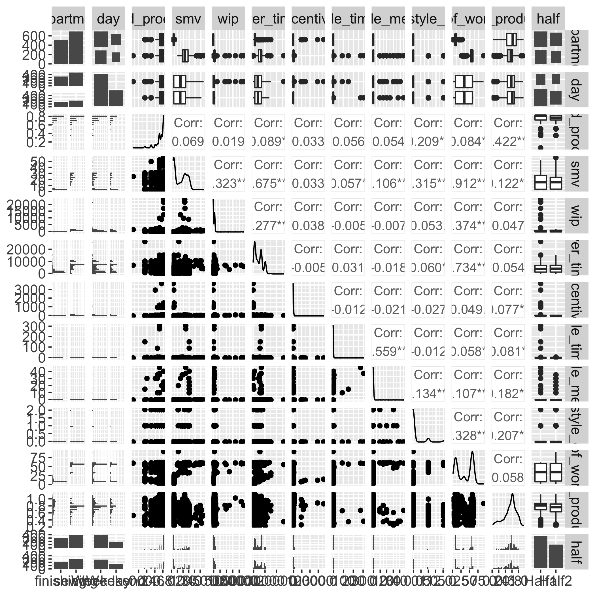
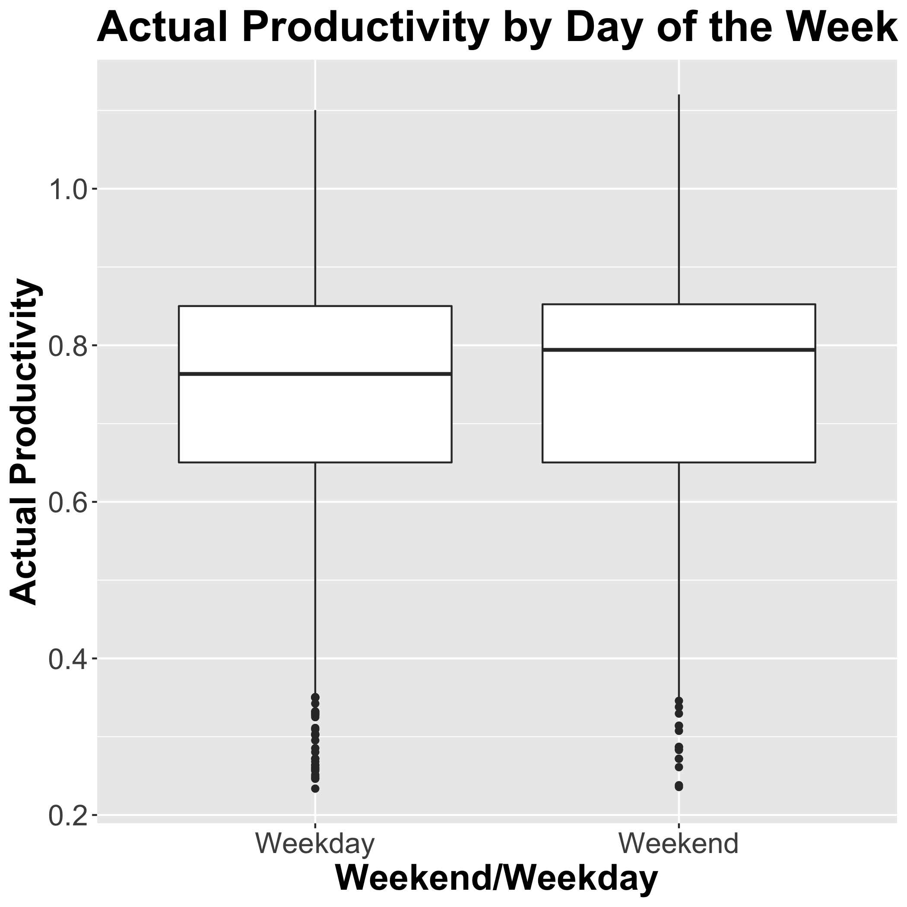
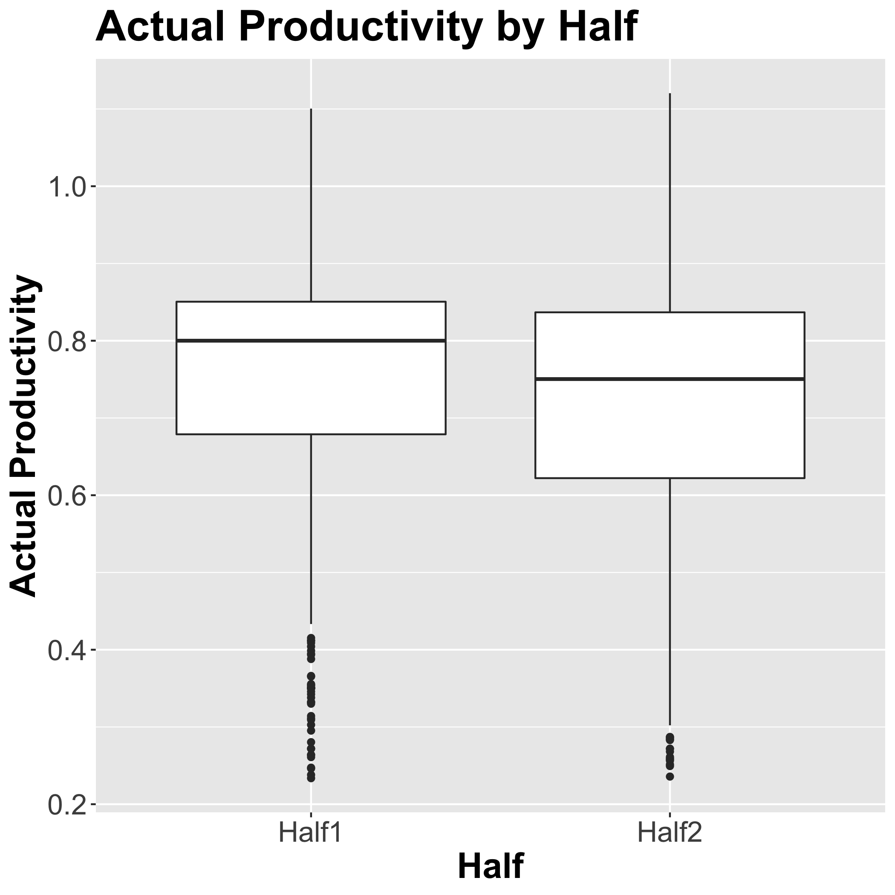
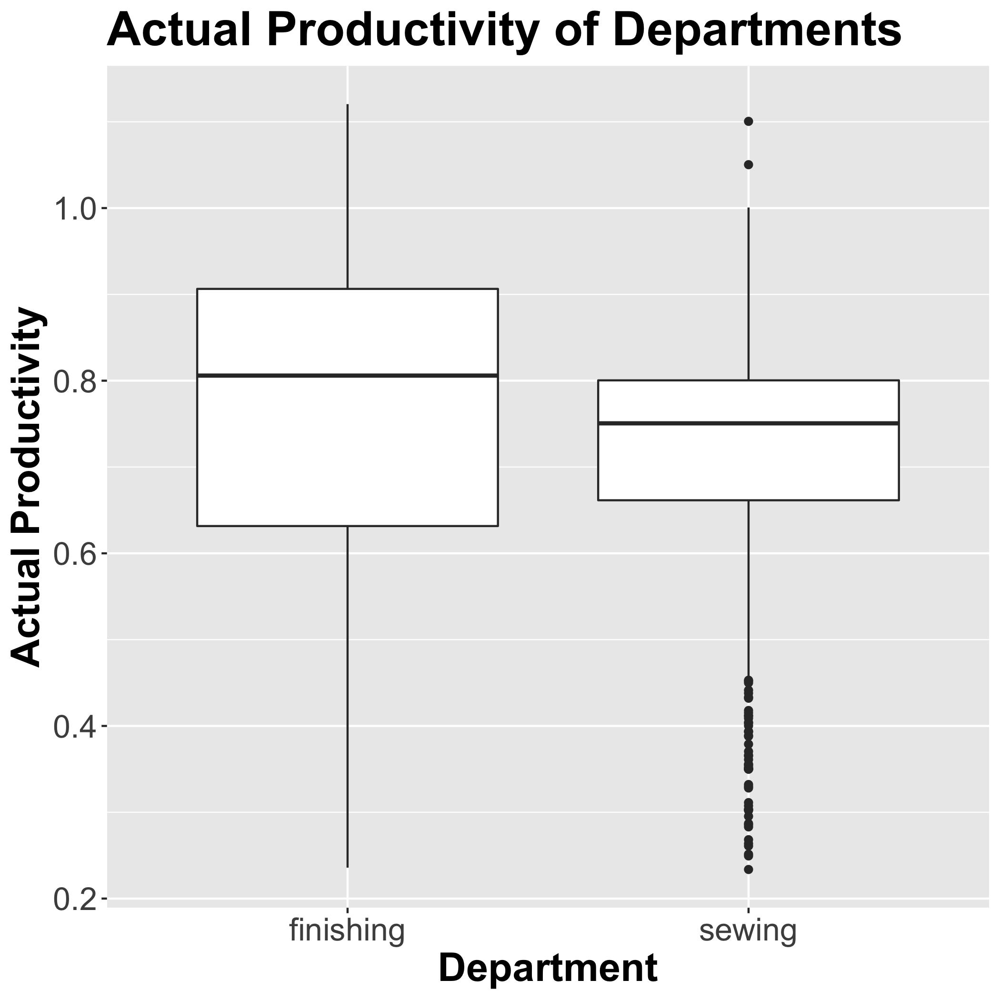
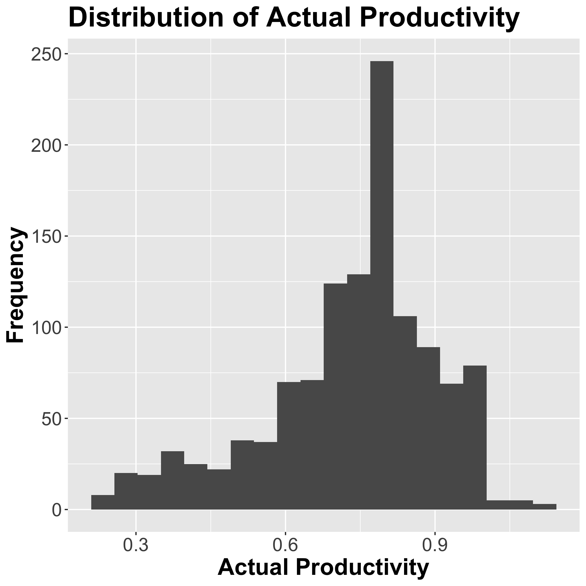
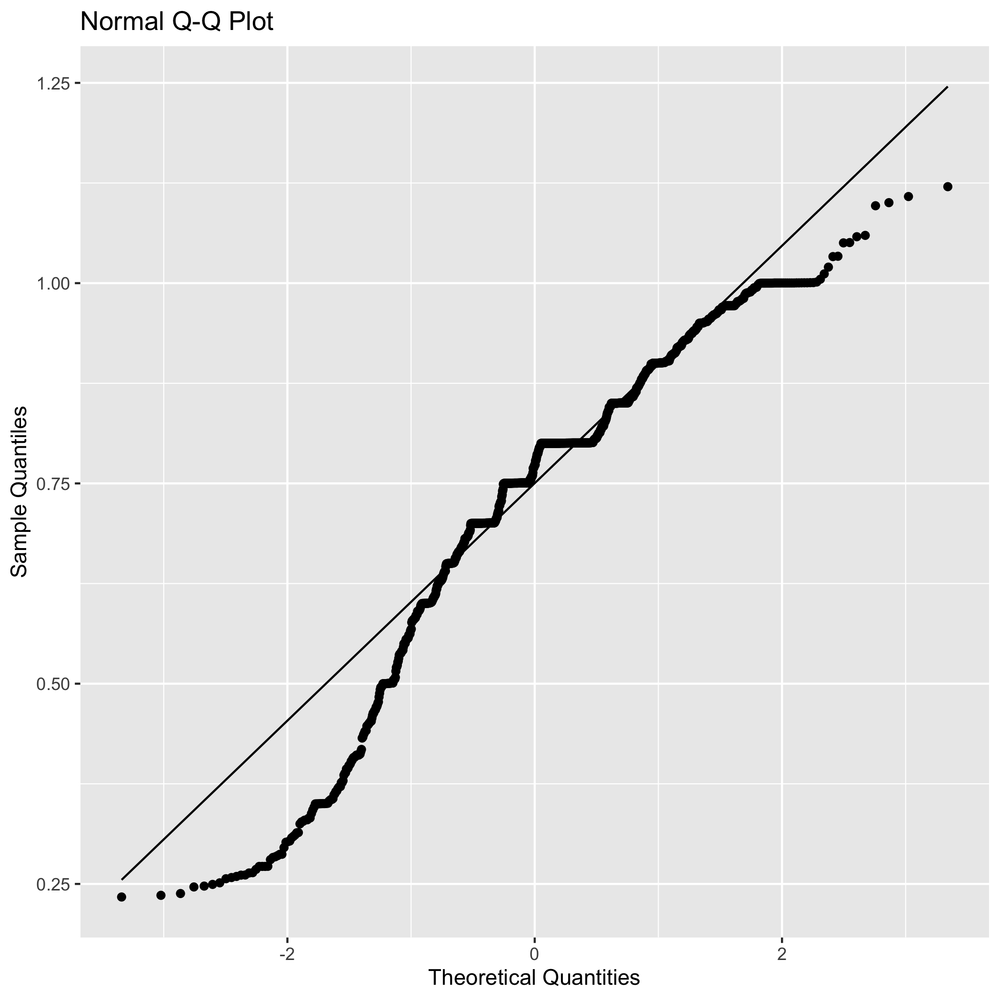
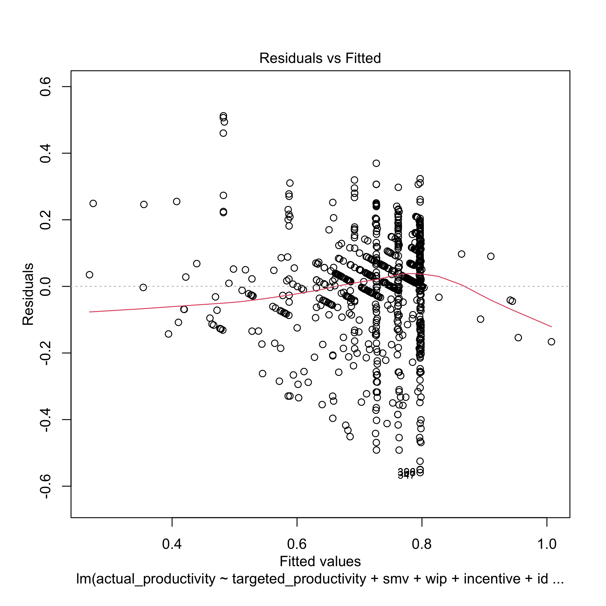
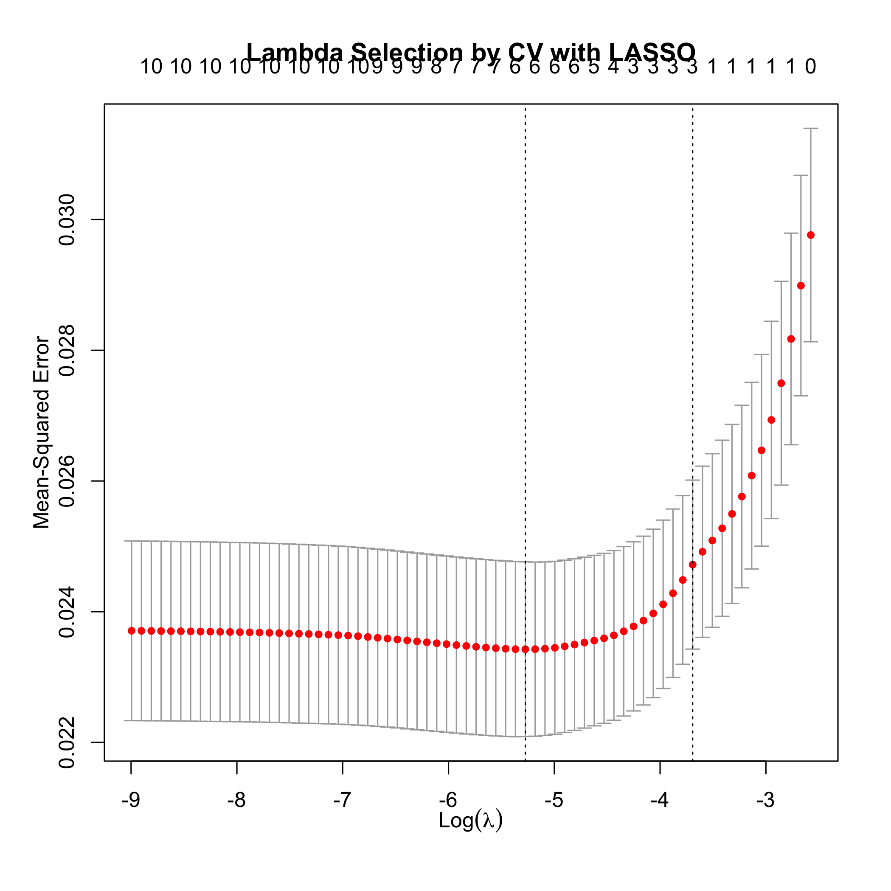
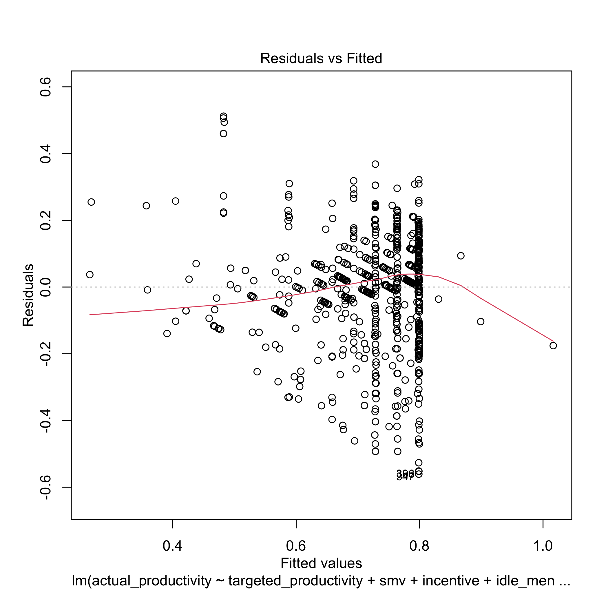

Adapted with permission from STAT 301 Project by: Justin Wong, Kevin Yu, Zhuoran (Serena) Feng, Fiona Chang

# Summary 
In this project, we perform a data analysis to determine the factors that impact the predict the productivity of a garment factory. Using forward selection and LASSO, we compare different models and determine which factors are the best in explaining relationships between the factors and the actual productivity of the garment factory. Furthermore, we discuss the implications of our results, the limitations of the project, and propose future  questions that can be asked based on our project.

# Introduction
The trillion-dollar garment industry is largely fueled by the production and performance of employees that work in manufacturing companies as a labor-intensive, low-skilled industry [@hamja2019effect]. As the industry is driven by ever-changing consumer demands and fashion trends, the need for manual processes is inevitable. Through statistical inference, we seek to dig deeper into the relationship between important attributes of the garment manufacturing process and its employees’ productivity in the following question: **What factors affect the productivity of a garment factory?** 

The studies: “Enhancing Efficiency and Productivity of Garment Industry by Using Different Techniques” [@rajput2018enhancing] and “The Effect of Lean on Occupational Health and Safety and Productivity in the Garment Industry” [@hamja2019effect] will be utilized to help frame our exploration into this data set and provide useful context of the garment industry.

## Attribute Information 
The data set we will use, called Productivity Prediction of Garment Employees, is sourced from Kaggle.com [@dataset] and outlines following variables that will guide us in answering our question:
- `date`: Date in MM-DD-YYYY
- `quarter`: A portion of a month, where each month was divided into 4 quarters
- `department`: Associated department
- `day`: Day of the week
- `team`: Associated team number
- `targeted_productivity_set`: Daily target productivity set by authority
- `smv`: Standard Minute Value; allocated time for a task
- `wip`: Work in progress; includes number of unfinished items for products
- `over_time`: amount of overtime by each team (minutes)
- `Incentive`: amount of financial incentive in BDT (Bangladeshi currency)
- `idle_time`: amount of time where production was interrupted
- `Idle_men`: number of workers idle due to interrupted production
- `no_of_style_changes`: number of style changes
- `no_of_workers`: number of workers in given team
- `actual_productivity`: actual % of productivity delivered

From this list, `date` and `team` were excluded in our analysis as they are identifiers for the observation, hence not the interest for our research question.

# Methods and Results 

## Preliminary Results

```{r message=FALSE, warning=FALSE, include=FALSE}
# Load Libraries
suppressPackageStartupMessages({
library(tidyverse)
library(broom)
library(GGally)
library(leaps)
library(glmnet)
    })
knitr::opts_chunk$set(echo = FALSE,
                      warning = FALSE,
                      message = FALSE)

```

```{r download-file, echo=FALSE}
data<-read.csv("../data/garments_worker_productivity.csv")
knitr::kable(head(data,3), caption = "Initial Dataset")
```

```{r clean-data, echo=FALSE}
data.filtered<-read.csv("../data/filtered_data.csv")
knitr::kable(head(data.filtered,3), caption = "Modified Dataset")
```

Both the categorical variables `day` and `quarter` were edited becasue they have more than two levels, which leads to difficulties in conducting forward selection. Based on this, `day` was changed into two levels: Weekday and Weekend. Similarilily, `quarter` was used to create the variable `half` with two levels.

```{r ggpairs-plot, fig.cap="ggpairs Plot", out.width="85%", echo=FALSE}

```

From this plot, we can analyze the correlation values between the variables that we are using in our analysis. Based on the correlation values, there appears to be correlation between input variables, which will be addressed later in the analysis.
Variables with relatively high correlations (over 0.65) include `no_of_workers` and `smv`, `no_of_workers` and `over_time`, and `over_time` and `smv`.

The high correlation indicates that the dataset has an issue of multicollinearity. To address this, the variable with the (`no_of_workers`) will be removed from our analysis.

```{r day-boxplot, fig.cap="Actual Productivity by Day of the Week Boxplot", out.width="50%", echo=FALSE}

```

```{r half-boxplot, fig.cap="Actual Productivity by Half Boxplot", out.width="50%", echo=FALSE}

```

```{r department-boxplot, fig.cap="Actual Productivity of Departments Boxplot", out.width="50%", echo=FALSE}

```

The above boxplots show the medians and variances of the discrete factors of interest. Since the above plots show that there are differences in the medians and variances of the factors of interest, it is justified to keep these factors in our analysis for future investigation.

```{r actual-productivity-hist, fig.cap="Distribution of Actual Productivity", out.width="50%", echo=FALSE}

```

Since, the distribution of the actual productivity doesn't seem to have a normal distribution and is slightly left-skewed, an assumption of normality is likely needed in our analysis.

```{r QQ-plot,  fig.cap="Q-Q Plot of Actual Productivity", out.width="50%", echo=FALSE}

```

The above Q-Q plot was used to determine whether a normality assumption on our response variable is valid, since it is an assumption required for tests used later on. There appears to be tails on both ends, which suggests a left-skewness of the data. Unfortunately, while we have tried different transformations of the data, it did not improve the skewness of this Q-Q plot. So based on what we have learned in this class, we will have to assume normality of the data even though it is a major stretch.

```{r summary-table-eda, echo=FALSE}
summary_table_1<-read.csv("../results/summary_table_1.csv")
knitr::kable(summary_table_1, caption = "Summary of Actual Productivity for Halves and Departments")
```

This table provides relevant summaries of our data, split into different quarters and departments. Overall, the data seems to be relatively consistent, with a few things to note:

- The relative means and medians are fairly consistent throughout the different departments and halves.
- The standard deviation for the finishing department is slightly larger than the sewing department.

## Methods: Plan 
The data set used is trustworthy and reliable since multiple published academic papers used this data set [@al2019deep], [@imran2021mining]. 

Using the data set, we plan to analyze what factors are the most important in productivity. Linear regression will be used to determine the best inference model for the actual productivity of the factory. Using forward selection and LASSO, we plan to compare different models and determine which factors are the best in explaining relationships between the factors and the actual productivity of the garment factory. Additionally, we plan to test our optimal inference model’s performance by splitting the data into training and testing and comparing the corresponding adjusted $R^2$ values with the full model.

We expect that factors such as number of members on the team and targeted productivity may have a higher association with actual productivity. Thus, we expect these factors to be present in the best model for explaining the relationship with the actual productivity.

The results from this report could provide insights to companies in the garment manufacturing sector. Having knowledge on what factors may increase productivity is crucial for any successful business.

## Results 

### Generating the Model with Forward Selection 

```{r train-test-split, echo=FALSE}
training_data<-read.csv("../data/train_data.csv")
knitr::kable(head(training_data,3), caption = "Top 3 Rows of Training Data")

testing_data<-read.csv("../data/test_data.csv")
knitr::kable(head(testing_data,3), caption = "Top 3 Rows of Testing Data")
```


```{r foward-selection-evalutation, echo = FALSE}
forward_selection_summary_metrics<-read.csv("../results/forward_selection_summary_metrics.csv")
knitr::kable(forward_selection_summary_metrics, caption = "Evaluation Metrics for Forward Selection")
```

Adjusted $R^2$ was chosen as the metric used for model selection because it is best suited for our inference model. It compensates for the reduction of the RSS of a larger model making it a more suitable metric than $R^2$.

As shown by the table above, the model with 6 input variables has the highest adj $R^2$, thus this model is chosen as the optimal model. However, its adjusted $R^2$ value is not relatively higher than many of the other models, suggesting that the model may be only slightly better than the others. The selected model will be compared with the full model to test this observation.

The variables selected in the model with 6 input variables  were: `targeted_productivity`, `smv`, `wip`, `incentive`, `idle_men`, and `no_of_style_change`. 

```{r summary-forward-selection, echo = FALSE}
model_forward_summary<-read.csv("../results/forward_selection_model_summary.csv")
knitr::kable(model_forward_summary, caption = "Forward Selection Model Summary")
```

```{r adj-R2-forward-selection, echo = FALSE}
adj_r_squared_1<-read.csv("../results/adj_R2_forward_selection_model.csv")
adjr2_fs<-round(as.numeric(adj_r_squared_1$a),4)
```
Adjusted $R^2$ for Selected Model: `r adjr2_fs`

```{r assumptions-plots,  fig.cap="Residuals of Selected Model", out.width="50%", echo=FALSE}

```

```{r assumptions-plots2,  fig.cap="QQ-plot of Selected Model", out.width="50%", echo=FALSE}

```

The residual plot and the Q-Q plot suggests some violations of assumptions needed for our analysis. The residual plot shows slight heteroskedasticity within our model, which violates our equal variance assumption, and the q-q plot suggests a violation in our normality assumption. 

```{r summary-full-model, echo = FALSE}
full_model_summary<-read.csv("../results/full_model_summary.csv")
knitr::kable(full_model_summary, caption = "Summary Table for Full Model")
```

```{r adj-R2-full-model, echo = FALSE}
adj_r_squared_1<-read.csv("../results/adj_R2_full_model.csv")
adjr2_full<-round(as.numeric(adj_r_squared_1$a),4)
```
Adjusted $R^2$ for Full Model: `r adjr2_full`

The adjusted $R^2$ of the selected model (`r adjr2_fs`) is slightly larger than (`r adjr2_full`) the full model. This further suggests the selected model is not significantly better than the full model. An F-test will be conducted to test this observation.

```{r f-test-forward-selection, echo = FALSE}
f_test<-read.csv("../results/forward_selection_f_test.csv")
p_fs<-round((f_test[6]) %>% filter(!is.na(.)),3)
knitr::kable(f_test, caption = "F-test for Full and Selected Model")
```

Since the p-value is `r p_fs`, at a 5% significance level, there is not enough evidence to reject the null hypothesis that the selected model performs better than the full model.

```{r forward-selection-test}
model_summary<-read.csv("../results/forward_selection_test_summary.csv")
knitr::kable(model_summary, caption = "Summary Table for Selected Model with Testing Data")
```

```{r adj-R2-test, echo = FALSE}
adj_r_squared_3<-read.csv("../results/forward_selection_adj_R2_test.csv")
adjr2_test<-round(as.numeric(adj_r_squared_3$a),4)
percent<-round(adjr2_test*100)
```
Adjusted $R^2$ for Selected Model Using Testing Data: `r adjr2_test`

The adjusted $R^2$ suggests that about `r percent`% of the adjusted variation in the response is explained by model. This indicates that the model performs fairly poorly. However, since it was the best model according to our analysis it may suggest that further exploration of this topic is needed. Thus, model selection using LASSO is conducted next.

### Generating the Model with LASSO 

```{r lasso-lambda,  fig.cap="Lambda Selection by CV with LASSO", out.width="70%", echo=FALSE}

```


The variables selected in the model by LASSO were:  `targeted_productivity`, `smv`, `incentive`, `idle_men`, and `no_of_style_change`. 

```{r lasso-assumptions-plots,  fig.cap="Residuals of Selected Model with LASSO", out.width="50%", echo=FALSE}

```

```{r lasso-assumptions-plots2,  fig.cap="QQ-plot of Selected Model with LASSO", out.width="50%", echo=FALSE}

```

Much like the model chosen by forward selection, the residual plot for the model selected by LASSO suggests unequal variance, and the Q-Q plot above suggests a normality violation of the variables. Attempts to mitigate this issue have failed, meaning we will have to continue with our analysis with very strong assumptions of our data.

```{r adj-R2-lasso, echo = FALSE}
adj_r_squared_lasso<-read.csv("../results/adj_R2_lasso.csv")
adjr2_lasso<-round(as.numeric(adj_r_squared_lasso$a),4)
```
Adjusted $R^2$ for Selected Model `r adjr2_lasso`

```{r lasso-f-test}
f_test<-read.csv("../results/lasso_f_test.csv")
p_lasso<-round((f_test[6]) %>% filter(!is.na(.)),3)
knitr::kable(f_test, caption = "F-test for Full and Model Selected with LASSO")
```

Since the p-value is `r p_lasso`, at a 5% significance level, there is not sufficient evidence to reject the null hypothesis that the selected model by LASSO performs better than the full model.

```{r lasso-test}
model_summary<-read.csv("../results/lasso_test_summary.csv")
knitr::kable(model_summary, caption = "Summary Table for Selected Model with Testing Data")
```

```{r adj-R2-test-lasso, echo = FALSE}
adj_r_squared_4<-read.csv("../results/adj_R2_test_lasso.csv")
adjr2_test_lasso<-round(as.numeric(adj_r_squared_4$a),4)
percent_l<-round(adjr2_test_lasso*100,1)
```
Adjusted $R^2$ for Selected Model Using Testing Data: `r adjr2_test_lasso`

The adjusted $R^2$ suggests that about `r percent_l`% of the adjusted variation in the response is explained by model. This reveals that forward selection performed slightly better in producing an inference model for the actual productivity of the factory.

# Discussion

## Findings 
### Model Selection with Forward Selection and LASSO 

The variables selected from forward selection in our model were: `targeted_productivity`, `smv`, `wip`, `incentive`, `idle_men`, and `no_of_style_change`. The variables selected from LASSO in our model were:  `targeted_productivity`, `smv`, `incentive`, `idle_men`, and `no_of_style_change`.

Both of the models produced a fairly poor adjusted $R^2$ values of `r adjr2_test` and `r adjr2_test_lasso` when testing the model with the testing data. Additionally, neither of the selected models were significantly better than the full model according to the corresponding F-tests. 

### Limitations 
The relatively poor performance of both selected models and the non-significant results from the corresponding F-tests may be due to the assumptions made throughout our analysis. The techniques learned in this class were likely not able to overcome the limitations and assumptions made throughout our analysis. As shown by the various model assumption plots throughout the analysis, the assumptions of equal variance and normality were used when analyzing the response variable, as well as both of the models selected via forward selection and LASSO. 

The assumption of normality was required for the F-tests used near the end of our analysis. With our diagnostic plots shown earlier showing some violation of the assumption, it may impact our results when testing for whether the models we selected were statistically different than the full model.

Another factor that may have led to our results being non-significant relative to the full model is the response variable (`actual productivity`) ranges from 0 to 1 while our explanatory variables have much broader ranges. In addition, the variables `wip`, `incentive`, `idle_time`, and `idle_men`, used in our analysis contained a large amount of 0s with a few observed large values leading to abnormal distributions of values.

These issues regarding normality and heteroskedasticity in our data and models may have resulted in inaccurate standard errors and thus induced lower precision from coefficient estimates, as well as inaccurate p-values and F-statistics. These limitations may have affected the statistical significance of our results.


## Impact 

The common variables included from both forward selection and LASSO were `targeted_productivity`, `smv`, `incentive`, `idle_men`, and `no_of_style_change`. The models suggest that the daily set productivity, allocated time for a task, financial incentive, number of idle workers, and number of style changes have the strongest correlation with actual productivity. These findings can drive business decisions of those in management and leadership positions as they could potentially manipulate each variable to drive the highest amount of productivity, and thus, profit. For example, a higher monetary incentive per item will motivate workers to be more efficient, and can have higher payoffs overall, though one should be cautious of unsatisfactory work.

The study “Enhancing Efficiency and Productivity of Garment Industry by Using Different Techniques” relays methods of increasing productivity by eliminating factors such as idle time, related to the `idle_men` variable in our model. These methods include time study, implementing a visual management system, and standardized work procedures which increased efficiency by 8.07% [@rajput2018enhancing]. Focussing on decreasing the number of style changes through process management can also increase productivity where less set-up and transition times between patterns reduce time wasted. “The effect of lean on occupational health and safety and productivity in the garment industry” outlines lean methodology where waste is minimized by reducing variability on all fronts of production [@hamja2019effect]. While there is evidence of positive effects on productivity by using lean, the literature also points to a potential negative impact on workers’ health– which morally outweighs monetary profit [@hamja2019effect].


## Future Questions 

This study prompts further questions about the garment industry. 
- How can we improve these variables to have a more efficient productivity? 
- What is the threshold of which productivity is maximized? 
- What other variables outside of this dataset, particularly involving technological innovation, affect productivity? - What is the environmental impact of increasing productivity?

# References 